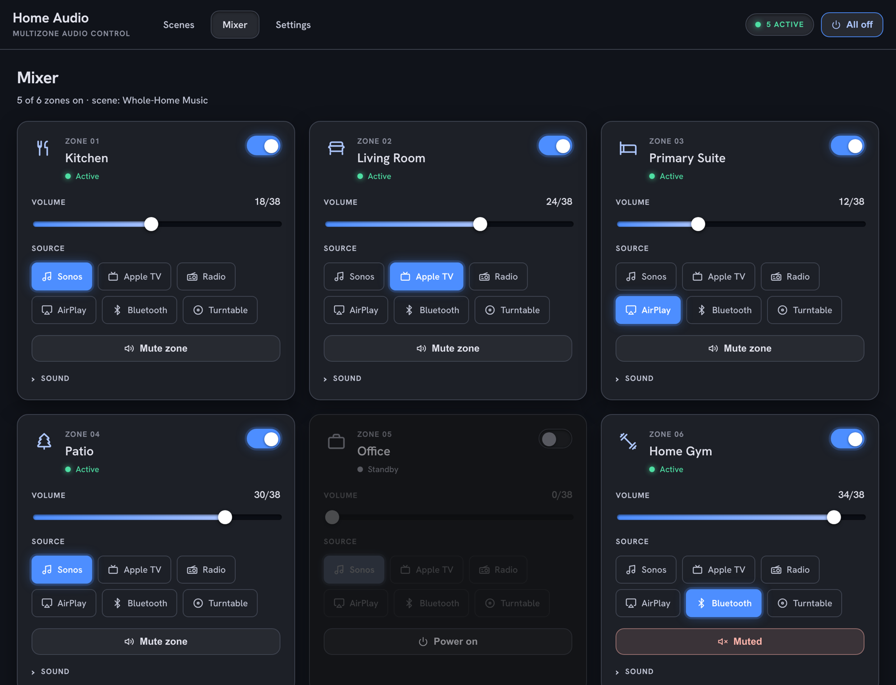
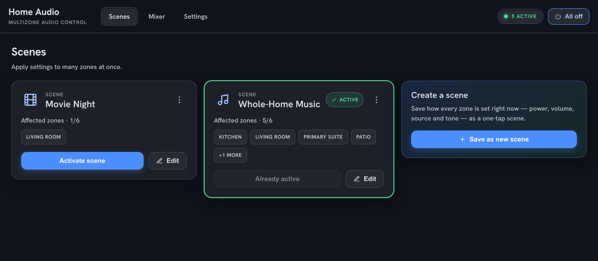
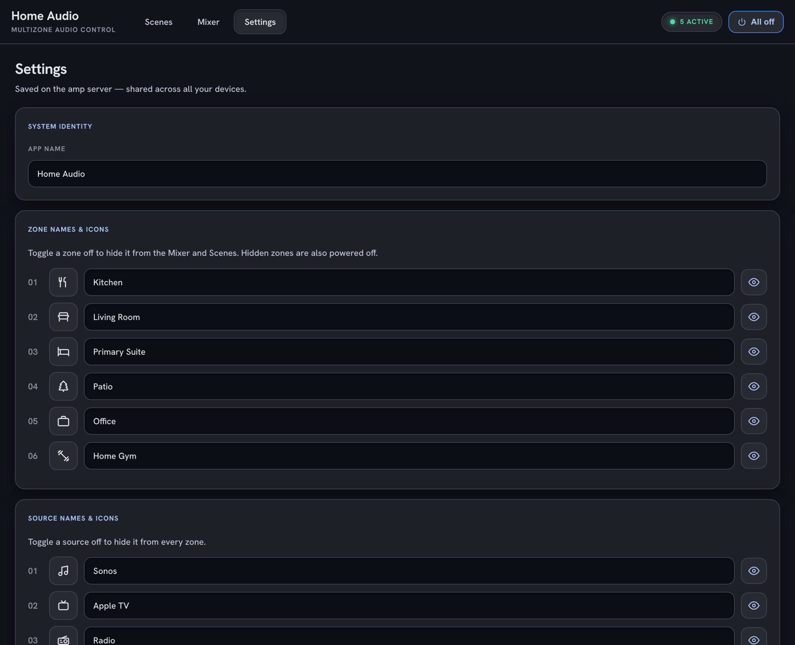

# Amp Control

A self-hosted LAN web app for controlling **Monoprice multizone amplifiers**
(and protocol-compatible clones like the Dayton Audio DAX66) over their RS-232
serial port. Runs on any machine with a USB-to-serial adapter — or a
serial-over-IP bridge — connected to the amp, serves a responsive web UI, and
exposes a small JSON API.

> **Tested hardware:** only the **Monoprice MPR-6ZHMAUT (10761)** has been
> verified on real hardware. The other models below are *built to be supported*
> from documented protocol specs but are **untested** — community confirmation
> is welcome.

- **Per-zone control** — power, volume, source, mute, bass, treble, balance.
- **Scenes** — capture the current state of every zone and recall it in one tap.
- **Customizable** — rename zones and sources, pick icons, hide unused zones.
- **Installable PWA** — add it to a phone home screen for an app-like experience.
- **Optional PIN** — protect Settings from accidental edits, enforced server-side.
- **mDNS** — reachable at a friendly `*.local` name with no DNS setup.

The whole frontend is a single static `public/index.html` (no build step); the
backend is a small Node/Express server that talks to the amp over serial.

## Screenshots

The **Mixer** — one card per zone with live state and instant, optimistic controls:



**Scenes** recall every zone at once; **Settings** lets you rename, re-icon, and
hide zones and sources:

| Scenes | Settings |
| --- | --- |
|  |  |

<sub>Screenshots use a demo configuration — fictional room and source names.</sub>

## Supported models

Select your amp with the `MODEL` environment variable. All of these speak the
same `?`/`<`/`#>` RS-232 protocol; only their dimensions differ, so support is
just a data profile.

| `MODEL`            | Amplifier                       | Zones/unit | Sources | Max units | Tested?            |
|--------------------|---------------------------------|:----------:|:-------:|:---------:|--------------------|
| `monoprice-6`      | Monoprice MPR-6ZHMAUT (10761)   | 6          | 6       | 3         | ✅ Yes (reference) |
| `monoprice-8`      | Monoprice 44518                 | 8          | 6       | 3         | ⚠️ Untested        |
| `monoprice-4`      | Monoprice 44519                 | 4          | 6       | 3         | ⚠️ Untested        |
| `monoprice-39261`  | Monoprice 39261 (passive matrix)| 6          | 6       | 3         | ⚠️ Untested        |
| `dayton-dax66`     | Dayton Audio DAX66              | 6          | 6       | 3         | ⚠️ Untested        |

`MODEL` defaults to `monoprice-6`. An unknown value falls back to it with a
warning. The 70V Monoprice 31028 is **not** supported: it uses a different
command syntax (not just different dimensions), like the Xantech family.

## Hardware

- A supported multizone amplifier (see above), up to 3 daisy-chained.
- A **straight-through** USB-to-RS232 serial cable/adapter (not null-modem), or
  a serial-over-IP bridge (ser2net, USR-TCP232, etc.) reachable on the LAN.
- The amp's serial link is **9600 baud, 8N1**.

## Requirements

- Node.js 18+
- A serial device the host OS can see (e.g. `/dev/cu.usbserial-XXXX` on macOS,
  `/dev/ttyUSB0` on Linux).

## Quick start

### One-command install (recommended)

```bash
git clone https://github.com/actravis/monoprice-multizone-controller.git
cd monoprice-multizone-controller
./setup.sh
```

`setup.sh` detects your OS, installs dependencies, scans for the serial port
(or lets you enter a `socket://` bridge URL), writes a `.env`, and optionally
installs a background service (launchd on macOS, systemd on Linux/Pi) so it
starts on boot and restarts on crash.

### Manual

```bash
npm install

# point it at your amp and start (MODEL defaults to monoprice-6)
DEVICE=/dev/ttyUSB0 npm start
# ...or over a serial-over-IP bridge:
DEVICE=socket://192.168.1.50:4001 MODEL=dayton-dax66 npm start
```

Not sure which serial port? List candidates with:

```bash
npm run ports        # = node server.js --probe
```

Then open `http://localhost:8080` (or `http://multizone.local:8080` from any
device on the same network).

## Configuration

All configuration is via environment variables — copy `.env.example` for the
full annotated list. The common ones:

| Variable     | Default                    | Description                                                      |
|--------------|----------------------------|------------------------------------------------------------------|
| `MODEL`      | `monoprice-6`              | Amplifier model profile (see Supported models).                  |
| `DEVICE`     | `/dev/cu.usbserial-210`    | Serial device path, or a `socket://host:port` serial-over-IP URL.|
| `BAUD`       | profile default (`9600`)   | Serial baud rate. Ignored for `socket://` devices.               |
| `PORT`       | `8080`                     | HTTP port for the web UI / API.                                  |
| `AMP_COUNT`  | `1`                        | Number of daisy-chained amps (clamped to the profile's max).     |
| `MDNS_NAME`  | `multizone`                | Advertises `http://<name>.local`. Empty = off.                   |
| `CONFIG_PATH`| `./config.json`            | Where shared settings are persisted.                             |

These can be set inline (`DEVICE=… npm start`), exported, or placed in a `.env`
file in the project root (loaded automatically; `setup.sh` writes one for you).

User-facing settings (zone/source names, icons, scenes, the PIN) are stored in
`config.json` next to the server. This file is created at runtime and is
**git-ignored** — it holds your personal setup and should never be committed.

## Security model

This app is designed to run on a **trusted home LAN** and has no user accounts.

- The optional Settings PIN is enforced **server-side**: the PIN is never sent
  to clients (only a "PIN is set" flag is), and changes to protected settings
  require the PIN via an `X-Settings-Pin` header. It guards against accidental
  edits — it is **not** a substitute for network security.
- Operational actions (changing volume/source, applying scenes) are
  intentionally open to anyone on the LAN.
- **Do not expose this server to the public internet.** If you need remote
  access, use a VPN or an authenticated reverse proxy.

## HTTP API

| Method | Path                 | Description                                      |
|--------|----------------------|--------------------------------------------------|
| `GET`  | `/api/health`        | Connection status, device, uptime.               |
| `GET`  | `/api/zones`         | State of all known zones.                         |
| `GET`  | `/api/zones/:zone`   | State of one zone (e.g. `11`–`16`, `21`–`26`).    |
| `POST` | `/api/zones/:zone`   | Set attributes, e.g. `{ "power":1, "volume":20 }`.|
| `POST` | `/api/poll`          | Force a refresh from the amp.                     |
| `GET`  | `/api/config`        | Shared config (PIN value omitted).                |
| `PUT`  | `/api/config`        | Update config (protected keys require the PIN).   |
| `POST` | `/api/unlock`        | Verify a PIN without changing anything.           |

Zone attributes accept friendly names or raw codes: `power` (0/1),
`volume` (0–38), `source` (1–6), `mute` (0/1), `bass`/`treble` (0–14),
`balance` (0–20, 10 = center). The exact ranges and source count come from the
active model profile; `GET /api/config` reports them under `profile`.

## Running as a service

The easiest path is `./setup.sh`, which installs and enables the right service
for your OS. To do it by hand, register `node server.js` (run from this
directory, so it picks up `.env`) with your service manager — a macOS
LaunchAgent or a Linux systemd unit.

## Development

`probe.js` and `loopback.js` are small helpers for testing the serial link and
the RS-232 wiring respectively; both honor the `DEVICE` environment variable.
`node server.js --probe` (`npm run ports`) just lists candidate serial ports.

## License

[MIT](LICENSE)
